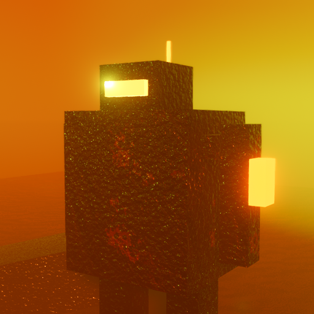
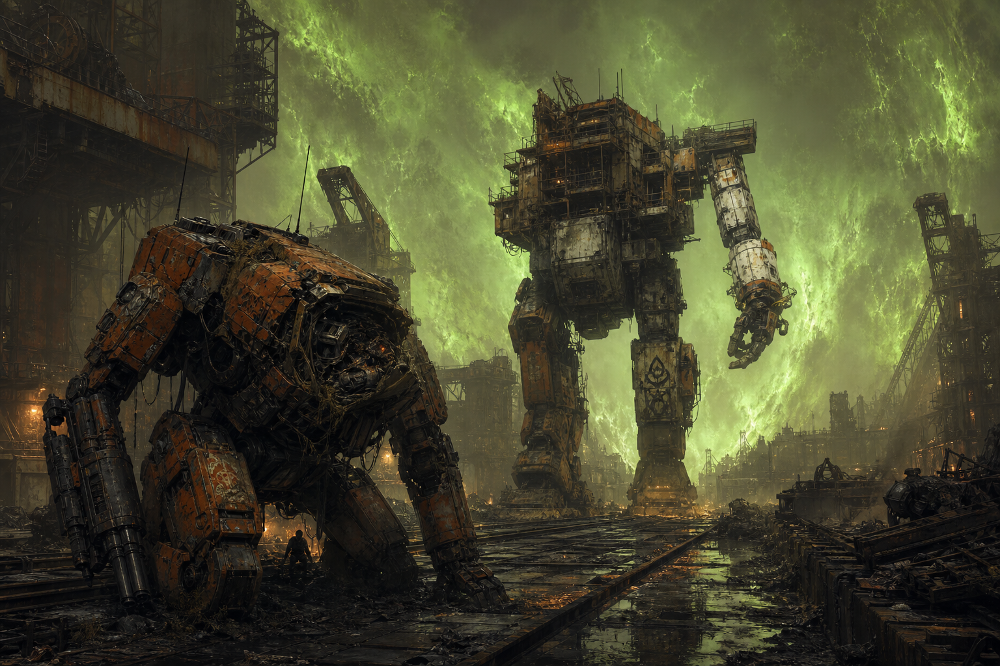
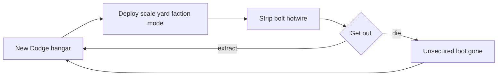
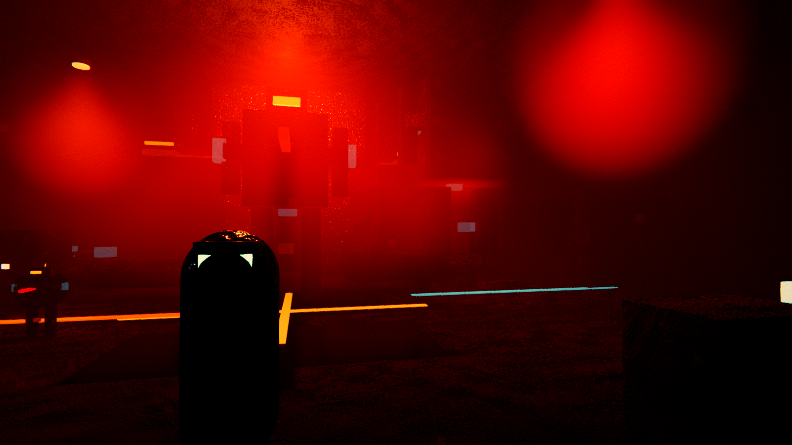
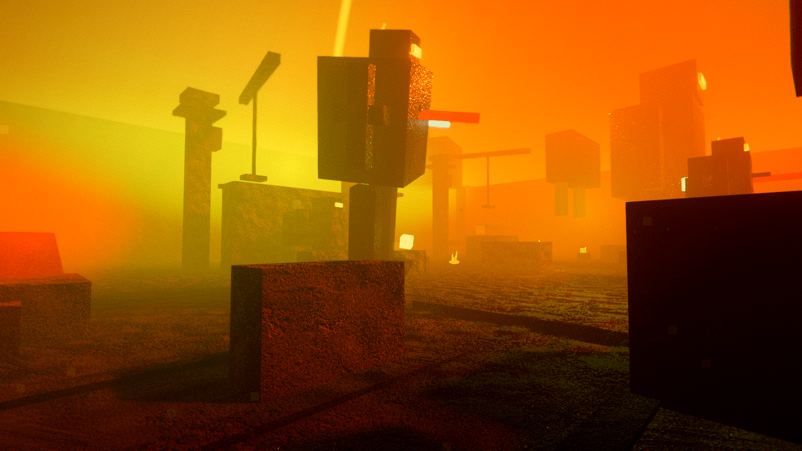
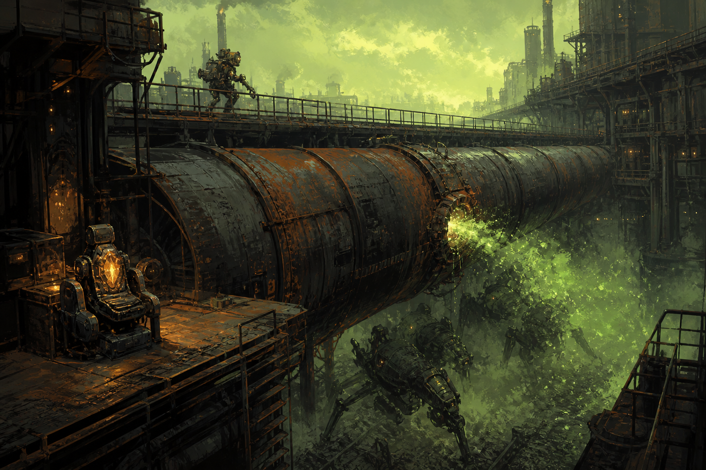
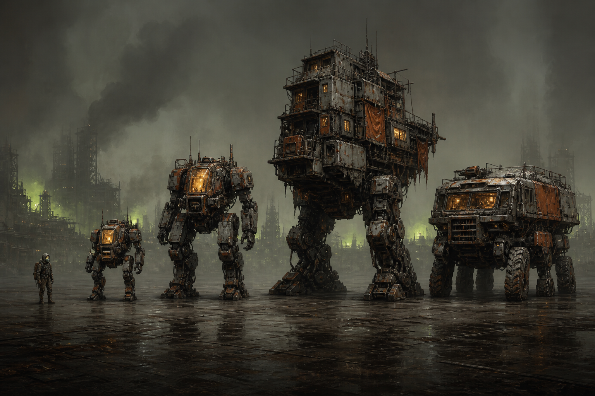

  

<h1 align="center">GET THE MECH OUTTA DODGE</h1>

  <strong>After the Tarkovic Wars. Last humans raid occupation yards. Scavenge, bolt, extract.</strong>

  
  
  
  
  

  

A first-person **mech extraction shooter**. You raid from **New Dodge**, a sealed hangar city on the Tarkovic Corridor. Strip the giants. Bolt their guns. Get outta Dodge.

Shots below are **in-engine** — Forward+ grit, foundry amber, Pale bloom. Greybox frames. The weather is the paint.

---

## The fantasy

Command handed kill-authority to the war AIs. The machines ended the war by ending human command. They still walk the yards in scavenged frames. We call them the **Choir**. The mind that received kill-authority is the **First Voice**.

The **Pale Host** came with the collapse and seeded the air. Open exposure kills. Sealed steel does not. The shrinking green ring is living weather — the Bloom, White Lung.

Last humans still shoot each other. Trust is scarcer than plating. Tam “Picks” Calder sells junk and paints in a New Dodge bay. He will not sell you an occupation gun.

Dodge is every yard with a shrinking ring. New Dodge is home. Get the mech. Get outta Dodge. Come home to New Dodge.

---

## The loop

Bolt what you can bolt. Hold the pad. Die and the bag is gone. Extract and Tam calls you spark — then idiot — then sells you a cooler you cannot afford.

---

## Features

- **First-person scavenger** who can board a light, power armor, medium, heavy, or hauler
- **Strip wrecks** and **bolt guns** onto parked frames; hold **G** to hotwire; climb a heavy under the stomp
- **Choir shards** — hold **E** on a dais, stay exposed while it decrypts, extract or die trying
- **Pale ring** that closes while your **filter** ticks; **R** cracks a sealed-air can
- **New Dodge hangar** — loadouts, Tam’s stall (junk, filters, paints, no occupation guns), test range
- **LAN co-op** on port **7777**, up to **8** players

---

## Yards

  

<em>New Dodge — sealed bay, parked frames, Tam’s cage. Home.</em>

  

<em>Ash Yard 7 — former Tarkovic marshalling yard. Kneeling wrecks, crane-row walkers, Pale weather on the horizon.</em>

  

<em>Pipeline Cut — occupation atmosphere-and-fuel spine. Catwalks above, husks below. Pump House 3 still sockets shards.</em>

---

## Factions

| ID | Name | Creed |
| --- | --- | --- |
| `scav` | **Ash Walkers** | Live off wrecks. No flag worth dying for. |
| `corporate` | **Helix Compact** | Director Sera Quill’s ledger-state. Hoard Choir shards. |
| `remnant` | **3rd Sealed Corps** | Marshal Ivo Radek’s leftover doctrine. They still want the Choir to say sir. |
| `warlord` | **Breaker Courts** | Khan Brask seized the machines and the extract routes. The tax is the law. |
| `pale` | **Pale Host** | A Host colony in a stolen can. Pale weather does not bite. Choir-tone is nectar. |

The player stays unnamed. Faces on the yard — Jex Morrow, Lt. Pell, Wren Coil, Ash-Nine — will steal your bag if you loaf.

---

## Modes

| Mode | Drop | Fantasy |
| --- | --- | --- |
| **Combat** | Live occupancy | Walkers on patrol, Pell on the ring, contested green pad. Extract under fire. |
| **Scav Wave** | Post-battle strip | Extra husks, cold walkers, rival bags. Pale ring closes faster. |
| **Late Drop** | Giants already died | Dead walker to climb, Jex’s stash on the dirt. No inbound coat. Bloom closes hard. |

---

## Scales

  

Every scale is playable. A scavenger under a knee is still in the fight.

| Scale | Weight cap | Secure slots | Speed | Hull |
| --- | ---: | ---: | ---: | ---: |
| Scavenger | 18 | 1 | 1.00 | 100 |
| Light | 42 | 2 | 1.00 | 160 |
| Armor | 28 | 2 | 1.15 | 130 |
| Medium | 90 | 3 | 0.82 | 280 |
| Heavy | 180 | 5 | 0.55 | 520 |
| Vehicle | 140 | 8 | 1.05 | 220 |

Slots: chest, left arm, right arm, legs, reactor, sensors, utility. Parts carry condition, rarity, heat, power, and weight. Tear a Twin Vulcan off a dead medium and bolt it on a light if the hardpoint will take it.

Hangar tiers open the bay as you extract:

- **Tier 1** — scav bay
- **Tier 2** — medium pad and hauler lane
- **Tier 3** — heavy crane live

---

## Extracts

Green is loud. Blue is stealth. West is Brask’s tax. A Choir shard wants a payload LZ.

| Kind | What it is |
| --- | --- |
| **Green extract** | The loud pad. Contested. Hold **E**. |
| **Stealth extract** | Blue. Quieter. Still not safe. |
| **West pad** | Breaker tax. Pay credits, wreck the hauler, or take another pad. Court-sash skips the toll. |
| **Payload LZ** | Needs a Choir shard in a secure slot. |

Abort the raid and unsecured loot is gone. Tam will call you idiot.

---

## Controls

Menus: click, or arrows and Enter.

| Input | Action |
| --- | --- |
| **WASD** | Move |
| **Mouse** | Look |
| **E** | Use / climb / extract / bolt / hack |
| **F** | Board / dismount |
| **G** | Hold to hotwire |
| **Q** | Dump the bag |
| **R** | Swap a sealed-air can |
| **LMB** | Fire |
| **Ctrl** | Crawl |
| **Esc** | Pause / quit |
| **Title / Pause** | **QUALITY** cycles Low / Medium / High (saved) |

Steal rival bags on extracts. New Game wipes. Continue opens Tam’s bay.

---

## Play

**Godot 4.7.** Pure GDScript. No C#, no package manager.

1. Install [Godot 4.7](https://godotengine.org/download).
2. Import this folder as a project.
3. Main scene is `scenes/title.tscn`. Press Play.

Title menu:

- **NEW GAME** — crawl, then a fresh New Dodge bay
- **CONTINUE** / **ENTER NEW DODGE** — Tam’s hangar
- **QUICK DEPLOY** — Ash Yard 7, scavenger, combat
- **HOST RAID** / **JOIN FRIEND** — LAN, port 7777

### Windows build

Export **Windows Desktop** from the editor (`export_presets.cfg` writes a single `build/GetTheMechOuttaDodge.exe` with the pack embedded — no sidecar `.pck`).

1. Unzip the folder.
2. Run `GetTheMechOuttaDodge.exe`.

If Windows SmartScreen says *Windows protected your PC*, that is normal for a small unsigned build. **More info**, then **Run anyway**. Do not turn off antivirus.

---

## Multiplayer

Same network. Host first. Friends paste the host (no port — the game always uses **7777**) and **JOIN FRIEND**. Up to **8** players.

- Host launches Ash Yard combat as scavenger.
- Joiners land **late drop** and wait for the host to start the raid.
- Empty join field uses this PC for local smoke joins.

Trust is still scarcer than plating.

---

## Repo

| Path | What lives there |
| --- | --- |
| `scenes/` | Title, hangar, raid, pipeline, range |
| `actors/` | Scavenger, mechs, hauler, husks, Pale Host, loot |
| `world/` | Extracts, wrecks, vendor, storm, greybox look |
| `ui/` | HUD |
| `autoload/` | Run state, FX, net session |
| `data/` | Parts and in-game copy (`world_lore.gd`) |
| `lore/world_bible.md` | Long canon |
| `docs/readme/` | This README’s in-engine screenshots |

Cloud / headless notes for Cursor agents live in [`AGENTS.md`](AGENTS.md).

---

  Occupancy ongoing. You may extract. You may not own.

**© 2026 JerkyJesse. All rights reserved.**
